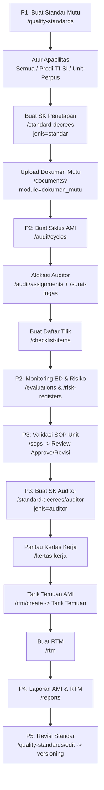
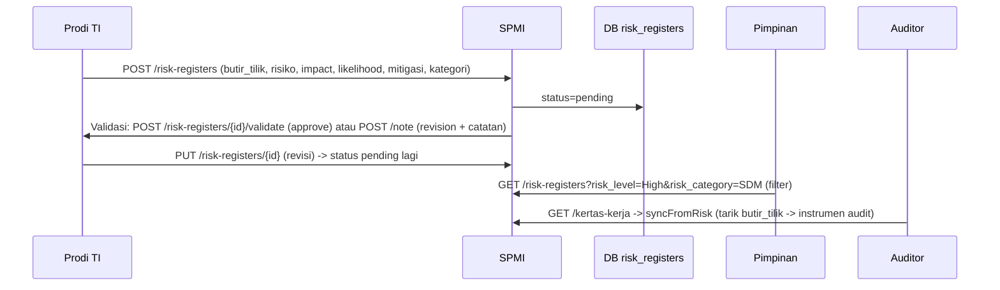

# Alur Tiap Role - Aplikasi SPMI Mardira (PPEPP)

> Aplikasi: Laravel 12 | RBAC spatie/laravel-permission | Sidebar dinamis per role
> URL: `http://127.0.0.1:8000/admin/*` | Login via `/login`

## Ringkasan Role

| Role | Akun Contoh | Tujuan Utama |
|------|-------------|--------------|
| `super_admin` | `super_admin@spmi.ac.id` | Akses penuh sistem |
| `administrator` | `admin@spmi.ac.id` | Master data & konfigurasi |
| `spmi` | `purnawati.labuh@example.org` / `spmi@spmi.ac.id` | Operator mutu (P1-P5) |
| `pimpinan` | `ketua@spmi.ac.id` | Persetujuan & pengesahan |
| `prodi` | `ti@spmi.ac.id` | Auditee prodi (isi ED, risiko, tindak lanjut) |
| `unit` | `unitpuslia@spmi.ac.id` | Auditee unit (isi ED, risiko, SOP bottom-up) |
| `auditor` | `asep@stmik-mi.ac.id` | Pelaksana audit |

---

## 1. SPMI (LPM) - Operator Pusat

**Sidebar:** Dashboard Mutu | Dokumen Mutu | **P1 Penetapan** | **P2 Pelaksanaan** | **P3 Pengendalian (AMI)** | **P4 Peningkatan Mutu** | **P5 Peningkatan Standar** | Audit Trail

### Alur Kerja (PPEPP)



**Akses Kunci:**
- `GET /quality-standards` + `POST /quality-standards` (CRUD standar + mapping apabilitas)
- `GET /standard-decrees` (filter `jenis=standar`) dan `GET /standard-decrees/auditor`
- `POST /standard-decrees/{id}/upload-file` (hanya SPMI, pimpinan tidak bisa upload)
- `GET /sops` (Validasi SOP Unit) → `POST /sops/{id}/review` {approve|revisi}
- `GET /risk-registers` (validasi → `POST /risk-registers/{id}/validate|note`)
- `GET /rtm/create` + `GET /rtm/findings/{cycle}` (AJAX tarik KTS/OB)

---

## 2. Pimpinan (Ketua/Wakil)

**Sidebar:** **P1 Penetapan** (SK Standar) | **P3 Pengendalian** (SK Auditor) | **P4 Peningkatan Mutu** (Laporan AMI & RTM, RTM, RTL)

### Alur Kerja

```mermaid
flowchart TD
    A[Login pimpinan] --> B[P1: Buka SK Penetapan Standar\n/standard-decrees]
    B --> C{Periksa Standar & Siklus}
    C -->|Lengkap| D[Klik Tetapkan\nPOST /standard-decrees/{id}/verify\nTTD otomatis]
    C -->|Belum| E[Koreksi via /standard-decrees/{id}/review]
    D --> F[P3: Buka SK Penugasan Auditor\n/standard-decrees/auditor]
    F --> G[Tetapkan SK Auditor]
    G --> H[P4: Buka Laporan AMI & RTM\n/reports]
    H --> I[Buka RTM\n/rtm]
    I --> J[Sahkan RTM\nPOST /rtm/{id}/approve]
    J --> K[Buka RTL\n/pimpinan/rtl]
    K --> L[Isi Catatan Tindak Lanjut\nPUT /pimpinan/rtl/{finding}/note]
```

**Catatan:** Tidak ada tombol **Upload SK**, tidak ada **Lihat Evaluasi Diri (ED)**. ED hanya untuk auditor/prodi/unit.

---

## 3. Prodi (Kaprodi)

**Sidebar:** Dashboard | **Evaluasi Diri** (Isi ED) | **AMI Pemantauan Mutu** (Risk Register, Info Jadwal Audit, Risalah RTM Disahkan)

### Alur Kerja

```mermaid
flowchart TD
    A[Login prodi TI] --> B[Isi Evaluasi Diri\n/evaluations/create\nHanya standar yang berlaku untuk prodi TI\nScope forUser]
    B --> C[Buat Risk Register\n/risk-registers/create\nPilih Standar -> Indikator terisi otomatis\ndata-indicators JSON\nPilih Kategori: Operasional/SDM/Keuangan/Teknologi/Kepatuhan/Reputasi\nIsi Impact/Likelihood 1-5 -> Skor & Level auto]
    C --> D[Status Menunggu Review]
    D --> E{SPMI Review}
    E -->|Revisi| F[Perbaiki & Upload Ulang\nStatus -> Menunggu Review]
    E -->|Disetujui| G[Lihat Info Jadwal Audit\n/audit/assignments]
    G --> H[Terima RTM Disahkan\n/rtm -> baca instruksi]
    H --> I[Tindak Lanjut Temuan\n/audit/findings/{id}/attachments]
```

**Filter Penting:**
- `QualityStandard::forUser(prodiUser)` → hanya standar tanpa mapping (Semua) **atau** mapping `prodi=TI` yang tampil di dropdown Risk Register. Standar untuk Unit Perpustakaan tidak tampil.
- `RiskRegister::index` terfilter `academic_program_id = user.program_id`

---

## 4. Unit (Kepala Unit - Bottom-Up SOP)

**Sidebar:** Dashboard | **Evaluasi Diri** (Isi ED) | **Manajemen SOP** (Manajemen SOP Unit) | **AMI Pemantauan Mutu** (Risk Register, Info Jadwal Audit, Risalah RTM)

### Alur Kerja (SOP Bottom-Up)

```mermaid
flowchart TD
    A[Login unit] --> B[Manajemen SOP Unit\n/sops]
    B --> C[Ajukan SOP Baru\n/sops/create\nJudul + Deskripsi + File PDF/DOC]
    C --> D[Status Pending\nMenunggu Review SPMI]
    D --> E{SPMI Review\n/sops/{id}/review}
    E -->|Revisi| F[Lihat Catatan Revisi\n/sops/{id} -> Upload Revisi\nPOST /sops/{id}/upload-revision\nStatus -> Pending lagi]
    E -->|Approved| G[Status Disetujui\nJadi evidence di P3]
    G --> H[Auditor lihat SOP Disetujui\nsebagai referensi Kertas Kerja]
    H --> I[Isi ED & Risk Register\nsama seperti Prodi]
```

**Tabel `sops`:** `unit_id`, `title`, `file_path`, `status` (draft/pending/revisi/approved), `review_notes`

---

## 5. Auditor

**Sidebar:** Dashboard | **Evaluasi Diri** (Lihat ED read-only) + Risk Register read-only | **Kertas Kerja** (Jadwal Penugasan Saya, Kertas Kerja Auditor, Panduan Etik)

### Alur Kerja

```mermaid
flowchart TD
    A[Login auditor] --> B[Lihat Jadwal Penugasan Saya\n/audit/assignments]
    B --> C[Unduh Surat Tugas & Jadwal Visitasi\n/surat-tugas/generate]
    C --> D[Buka Kertas Kerja\n/kertas-kerja\natau /audit/instruments/{assignment}]
    D --> E[Lihat Bukti ED Prodi/Unit]
    E --> F[Isi Instrumen & Temuan\nPOST /audit/instruments & /audit/findings\nJenis: KTS/OB + evidence E-Filing]
    F --> G[Lihat SOP Disetujui Unit\nsebagai referensi]
    G --> H[Lihat Laporan AMI\n/reports read-only]
```

**Akses:** `role:auditor` + `auditor_id = assignment.auditor_id` untuk generate surat tugas milik sendiri.

---

## 6. Administrator

**Sidebar:** Pengaturan (Program Studi, Unit Kerja, Tahun Akademik, Manajemen User, Konfigurasi Aplikasi, Halaman Publik) | Sistem & Supervisi (Audit Trail) | Dokumen Mutu

### Alur Kerja
- Kelola master `academic_programs`, `units`, `academic_years`, `users` (assign role + prodi/unit)
- Kelola `settings` (logo, kop, TTD)
- Kelola `pages` (halaman publik)
- Lihat `activity-logs` (audit trail - semua role)
- Tidak akses P1-P5 operasional (hanya SPMI)

---

## 7. Diagram Sequence Lintas Role (Contoh: Risk Register)



---

## 8. Mapping Apabilitas Standar (Fitur Baru)

**SPMI di `/quality-standards/create|edit`:**
- Radio `Semua Prodi & Unit` (default) → tidak buat row di `quality_standard_applicability` → berlaku semua
- Radio `Terbatas` → checklist `selected_programs[]` + `selected_units[]` → buat row `target_type=prodi/unit`

**Contoh:**
- Standar A,B,C tanpa mapping → semua prodi/unit lihat
- Standar D mapping `prodi=TI` → hanya Prodi TI lihat (Prodi SI tidak)
- Standar E mapping `unit=Perpustakaan` → hanya Unit Perpustakaan

**Scope:** `QualityStandard::forUser($user)` dipakai di `RiskRegisterController@create|edit` untuk filter dropdown Standar Mutu.

**Kolom Index:** Badge `Semua` (hijau) atau badge Prodi (biru) / Unit (cyan).

---

## 9. Cara Uji Cepat per Role

```bash
php artisan serve --port=8000
# http://127.0.0.1:8000/login
```

| Role | Email | Password |
|------|-------|----------|
| spmi | `purnawati.labuh@example.org` | `password` |
| pimpinan | `ketua@spmi.ac.id` | `password` |
| prodi | `ti@spmi.ac.id` | `password` |
| unit | `unitpuslia@spmi.ac.id` | `password` |
| auditor | `asep@stmik-mi.ac.id` | `password` |
| administrator | `admin@spmi.ac.id` | `password` |

**Checklist uji:**
- [ ] SPMI buat standar custom prodi TI → login Prodi TI lihat, Prodi lain tidak
- [ ] Unit ajukan SOP → SPMI approve/revisi → Unit upload revisi
- [ ] Prodi buat Risk Register → pilih Standar → Indikator terisi otomatis (data-indicators JSON)
- [ ] SPMI tarik temuan di RTM create
- [ ] Pimpinan Tetapkan SK (TTD otomatis) → SPMI upload file

---
*Generated: 2026-08-19 | File: `ALUR_PER_ROLE_SPMI.md` | Graphify nodes: 817, edges: 1351*
